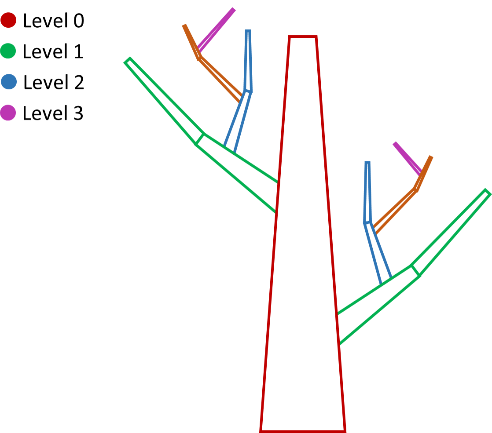
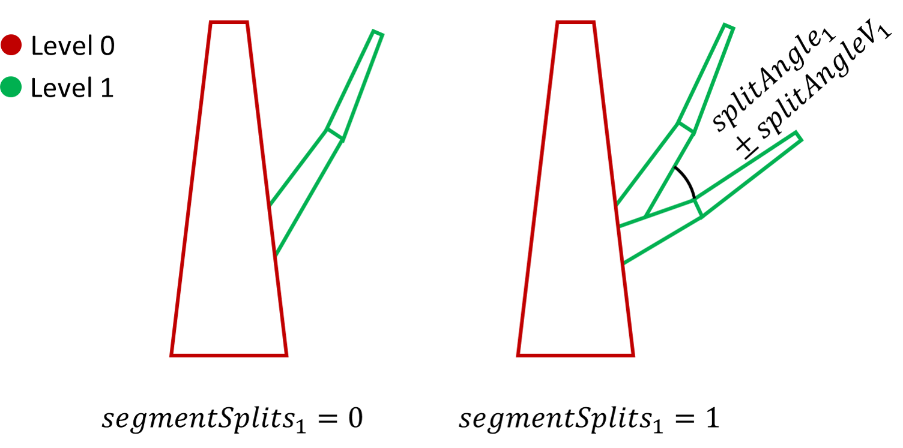
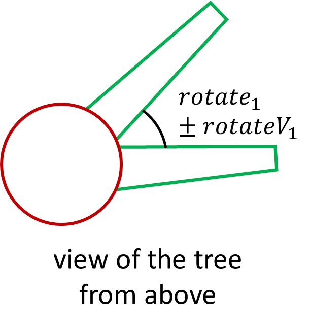
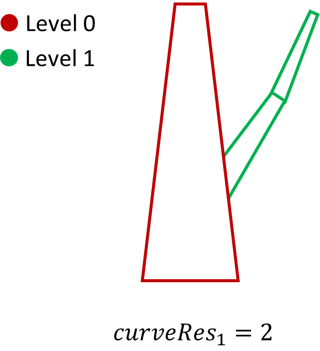
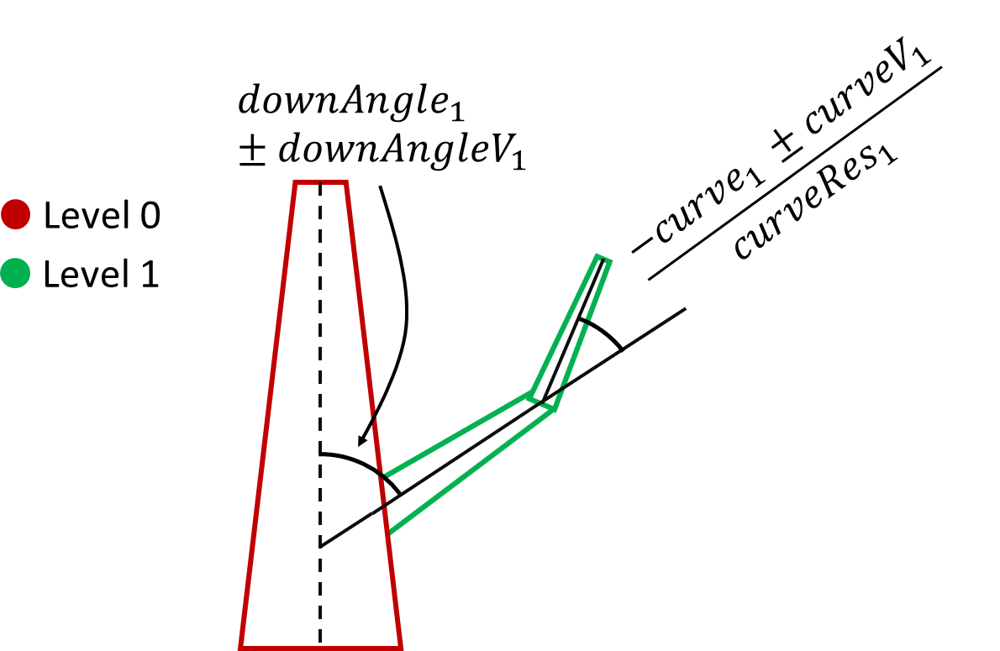
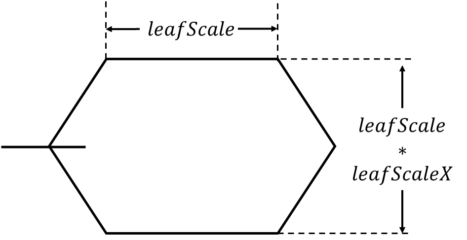

# Appendix: Render Tree parameters

Our RT Blender add-on is based on the
well-known Sapling Tree Gen. The parameters we used through RT add-on to
reconstruct the 3D trees can be organized into five classes: geometry,
branch radius, branch splitting, branch growth, and leaves. Although
there are other classes, such as pruning, armature, and animation, we
don't describe their parameters because we do not take into
consideration such values for our trees and where there are mandatory we
set them as a default values.

## Geometry

This class represents parameters that define the general tree geometry
and its level of detail (LOD).

-   **Bevel Resolution**: controls the surface smoothing of the tree;

-   **Handle Type**: represents the curve points type (we used the
    default value *auto*);

-   **Shape**: sets the basic shape of the tree, by choosing among $9$,
    conical, inverse conical, cylindrical, spherical . There is a tenth
    value which activate the **customShape** parameter consisting of $4$
    values, one for each tree level, trunk, branches of the first,
    second, and third level, as shown in
    <a href="#tree_levels">Figure 1</a>. Each value represents the length of
    component of each level;
    |  | 
    |:--:| 
    | *Figure 1 - Length of tree components can be set with 4 customShape values. Level 0 represents the trunk length, level 1 represents the first branches length, level 2 the second branches length, and the level 3 the fourth branches length* |

-   **Secondary Splits**: changes the style of secondary branches;

-   **Branch Distribution**: defines the distribution of the branches by
    gathering them on the base or on the top of the trunk according to
    its value;

-   **Branch Rings**: places branches around the trunk as a ring shape,
    providing also the number of rings (Pine Tree);

-   **Random Seed**: is useful to generate same type trees;

-   **Scale** and **Scale Variation**: defines the base height of the
    tree.

## Branch Radius

This class represents parameters useful to define the branches radius.

-   **Ratio**: is a branch thickness base value.

-   **Radius Scale** (scale0) and **Radius Scale Variation** (scaleV0):
    define the trunk radius scale and its variation range.
    $$radius_{trunk} = length_{trunk} * ratio * (scale0 \pm scaleV0)$$ 
    where: $radius_{trunk}$ is the trunk radius, and $length_{trunk}$ is the trunk length;

-   **Branch Radius Ratio** (ratioPower): defines the next level
    branches thickness value as follows:
    $$radius_{child}=radius_{parent}\left(\frac{length_{child}}{length_{parent}}\right)^{ratioPower}$$ 
    where: $radius_{child}$ is the previous branch radius, $radius_{parent}$ is the next branch radius, $length_{child}$ is the previous branch length, and $length_{parent}$ is the next branch length;

-   **Minimum Radius**: is the minimum radius value allowed for the
    thinnest branch;

-   **Close Tip**: if selected, closes the tip of the branches;

-   **Root Flare**: creates a conical shape at the base of the tree;

-   **Taper**: contains a value for each level to define the branches
    tip thickness;

-   **Tweak Radius**: contains a value for each level which is
    multiplied with Branch Radius Ratio to keep major control on the branches
    thickness.

## Branch Splitting

This class contains the split of the branches parameters. Each level
branches can be split, or cloned into other branches of the same level
of the starting branch, as shown in
<a href="#02_segSplits_splitAngle">Figure 2</a>.

|  | 
|:--:| 
| *Figure 2 - Branches splitting example* |

-   **Levels**: represents the number of branch levels, with $levels=2$,
    a tree with trunk and first level branches will be generated;

-   **Base Splits**: and Segment Split (described later) affect the
    trunk splitting;

-   **Trunk Height**: indicates the trunk height percentage from which
    the branches are placed;

-   **Secondary Base Size**: decreases the base dimension for each
    level;

-   **Split Height**: defines a height threshold below which there are
    no subdivisions in the tree;

-   **Split Bias**: changes the splittings distribution by gathering
    them at the top or bottom of the tree;

-   **Branches**: number of branches for each level;

-   **Segment Splits** (segSplits): number of splittings for each branch
    segment. With $segSplits = 0.0$ there is not splitting, with
    $segSplits = 1.0$ the branch is dichotomously divided, with
    $segSplits = 2.0$ the branch is divided in three parts, and so on up
    $3$ as maximum value;

-   **Split Angle** and **Split Variation**: represent the angle
    amplitude and its variation;

-   **Rotate Angle** and **Rotate Variation**: represent the direction
    grow angle and its variation, as shown in
    <a href="#03_rotate_rotateV">Figure 3</a>;

-   **Branch Rotate**: represents the branch rotation angle for the
    branch rotation matrix, in which is defined also the rotation axis.

-   **Rotation Last Angle**: is the last parent rotation which is summed
    with the current branch rotation to obtain the Branch Rotate
    parameter.
    
    |  | | 
    |:--:|:--:|
    | *Figure 3 - Branches rotation* | *Figure 4 - Curve resolution* |

-   **Outward Attraction**: curve branches toward the external;

-   **Branching Mode**: uniformly distributes the branches, allowing
    them to point toward external, starting from the branch center, or
    from the tree center, or randomly;

-   **Curve Resolution**: defines the number of segments of each branch.
    Increasing such value more and more sinuous branches can be obtained
    (see <a href="#04_curveRes">Figure 4</a>).

-   **Sign**: defines sign of the angle obtained by summing the split
    angle and split angle variation.

## Branch Growth

This class contains parameters to set the tree branches growth (see
<a href="#05_downAngle">Figure 5</a>).
|  | 
|:--:| 
| *Figure 5 - Branches Growth* |

-   **Taper Crown**: decreases the trunk dimension and its respective
    subdivision;

-   **Length** and **Length Variation**: determine respectively the
    branches length of each level and the variation range;

-   **Down Angle** (downAngle) and **Down Angle Variation**: pull back
    the branch, increasing the amplitude of the angle between it and the
    branch on which it grows (parent branch);

-   **Curvature** and **Curvature Variation**: are useful to pull back
    the branches, curving them inwards;

-   **Back Curvature**: curves the tips of the branches;

-   **Vertical Attraction**: pull the branch towards the ground;

-   **Use Old Down Angle Variation**: if selected, it uses the downAngle
    parameter of the previous branch (parent branch);

-   **Use Parent Angle**: if selected, it rotates the branch to match
    the previous branch;

## Leaves

This class contains parameters to set the foliage. The crown of the tree
can be enabled or disabled as needed (see
<a href="#06_leaf_horizontal">Figure 6</a>).
|  | 
|:--:| 
| *Figure 6 - Foliage setting parameters* |

-   **Leaf Shape**: set the leaf shape, which can be rectangular,
    hexagonal, dupliface, or duplivert;

-   **Leaves**: determines the leaves number for each branch;

-   **Leaf Distribution**: indicates the leaves distribution type;

-   **Leaf Down Angle** and **Leaf Down Angle Variation**: pull back the
    leaves, increasing the amplitude of the angle between it and the
    branch on which it grows (parent branch);

-   **Leaf Rotation** and **Leaf Rotation Variation**: are the leaves
    direction grow angle and its variation;

-   **Leaf Scale** and **Leaf Scale Variation**: determine the leaves
    scale and its variation range;

-   **Leaf Scale X**: scales the leaves along the X axis;

-   **Leaf Scale Taper**: scales the leaves towards the tip or base of
    the branch on which they grow;

-   **Horizontal Leaves**: if enabled, the leaves are turned upwards;

-   **Leaf Angle**: pull the leaves towards the ground.

