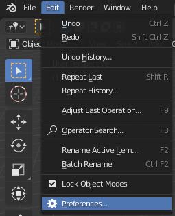
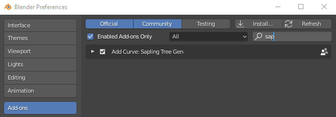
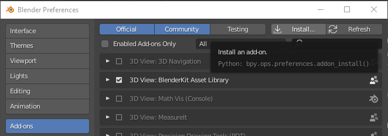
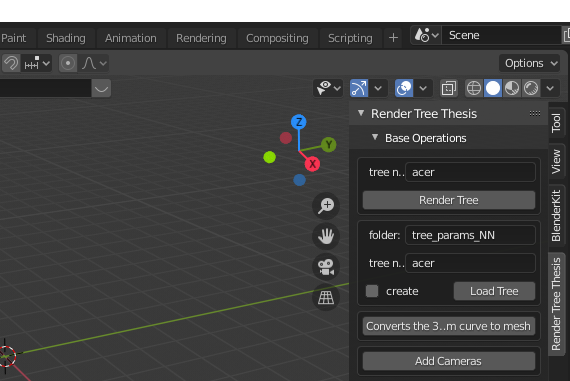
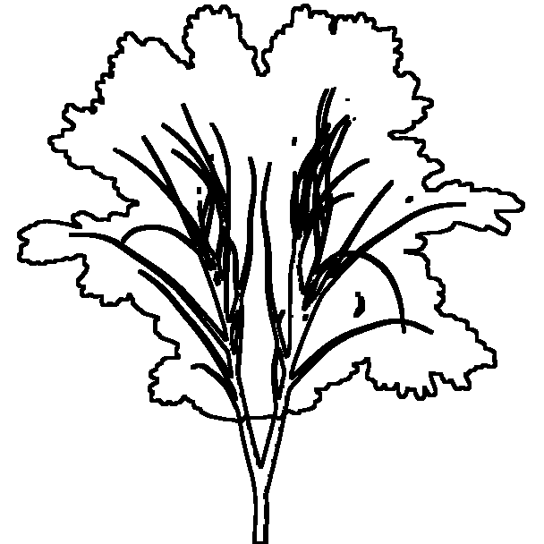
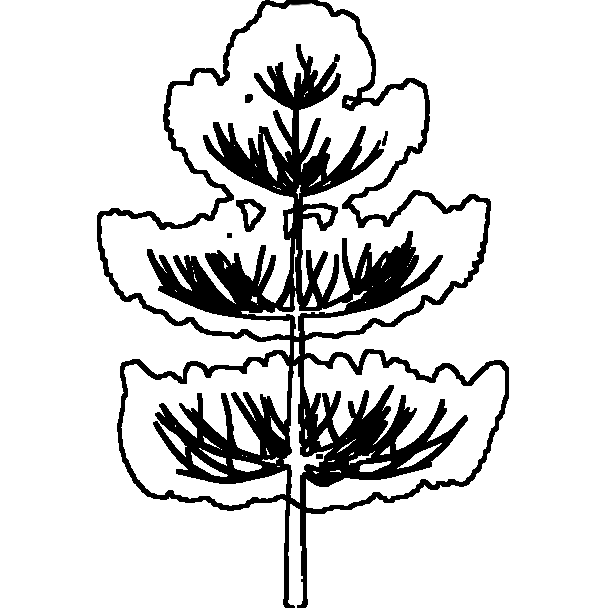
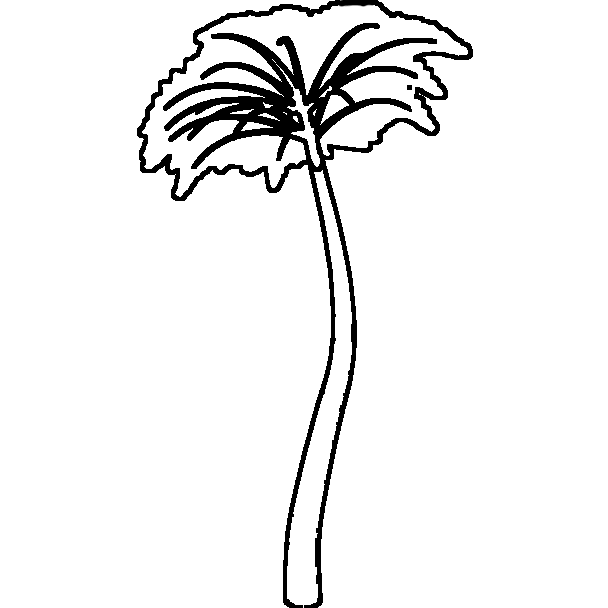
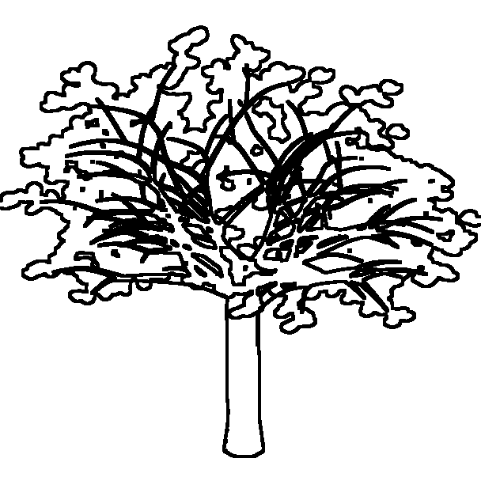
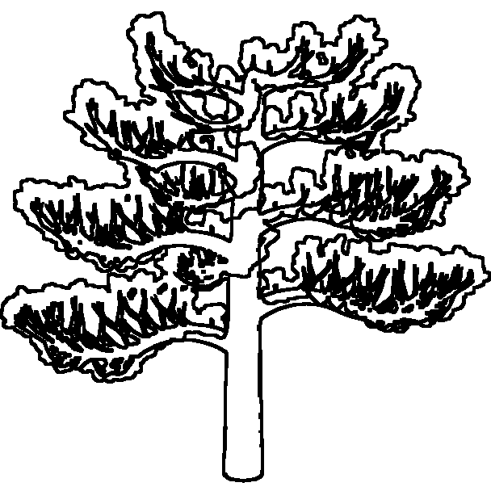

# Tree Sketch to 3D tree meshes


## Overview
TreeSketchNet is an automated procedural modelling <sup>[1](#References)</sup> system based on Deep convolutional Neural Network (DNN) which is described in our preprint [paper](). 
This system allows to create 3D tree meshes by predicting the Weber and Penn<sup>[2](#References)</sup> parameters using simple hand drawn sketches as input of DNN. In particular this system can recognize and create 3D mesh of specific 5 trees such as Maple, Cherry, Pine, Bonsai, and Plam.

In this repository, we provide: 
* Render Tree (RT) Blender add-on to generate synthetic hand-made (SHM) sketches defining Weber and Penn parameters
* Our training and validation datasets which cosist of SHM and paraemeters obtained through RT addon and realistic sketches obtained through Mean Adaptive Filter (MAF)<sup>[3](#References)</sup>
* The code of our system from which you can choose one of the core model architectures that we tested for our purpose (AlexNet<sup>[4](#References)</sup>, ResNet-50<sup>[5](#References)</sup>, VGG-16<sup>[6](#References)</sup>, Inception V3<sup>[7](#References)</sup>)
* Our pretrained Inception V3 final architecture of which our weight are available

## Specification
* Python 3.7.4
* Tensorflow 2.2.0, tensorflow-addons, Cuda 10.1
* Numpy
* Blender 2.82

For Blender installation click on [this link](https://download.blender.org/release/Blender2.82/).  
For Tensorflow and Cuda installation follow [this guide](https://www.tensorflow.org/install/pip).  
After installing tensorflow, you can install numpy and tensorflow-addons via the Python **pip** package manager, as follows:
```
$ pip install numpy tensorflow-addons
```

## Usage
### Neural Network
In [NeuralNetwork](NeuralNetwork) folder you can find the code related to the neural network architecture.  
* You can download the dataset used in our work from [here](). You need to unpack the .zip file and copy its content in the [NeuralNetwork/train_validation_set](NeuralNetwork/train_validation_set) folder.  
You can create your own dataset using the Blender add-on [Render Tree]().
* To test our pre-trained network you can download the model form [here](), copy the entire folder content in [NeuralNetwork/logs_archive](NeuralNetwork/logs_archive) and execute the `test.py` file.
* You can find all the network architectures tested in this paper in [my_model.py](NeuralNetwork/models/my_model.py) file. To train one of these networks, in `train.py` you need to set the `model_name` variable, choosing from the strings listed below:
  * `resnet50_multiple`: ResNet50
  * `inception_multiple`: InceptionNet V3
  * `vgg16_multiple_skip`: VGG-16 with skip connections
  * `alexnet_multiple`: AlexNet
* You can also change the directory in which to save the trained model by editing the `log_dir` variable in the `train.py` file. Remember that if you need to test your trained network you have to change the same variable in the `test.py` file!
* You can early stop the training from terminal with `Ctrl + C`. The procedure will save the model with best weights.
* To continue the training of an early stopped model, in the `train.py` file you must
  * change the `load_dir` variable with the directory where the saved model is located;
  * set the `load_model` variable to True.

  Remember that the saved model architecture must be the same as that indicated by the `model_name` variable.
<inserire indicazioni per il download del dataset e del modello. Inserire indicazioni sulla struttura della cartella di test>
 
### Blender add-on Render Tree
 For the installation of the Render Tree add-on you need to follow these steps:
 1. In the installation folder of Blender 2.82 (for example `C:\Program Files\Blender Foundation\Blender 2.82\`), open `addons` folder following this path `Blender 2.82\2.82\scripts\addons\`. Download the [add_curve_sapling.zip](add_curve_sapling.zip) file, unzip it and paste the `add_curve_sapling` folder in the `addons` directory replacing the existing files.
 2. Enable the Sapling Tree Gen add-on as shown in the following images  
  
 3. Download [addon_render_tree_thesis.zip]() file.
 4. In `Blender Preferences -> Add-ons` click on `Install...` and selected the .zip file downloaded in point 2. After the installation enable the Render Tree add-on by checking the box to the left of its name.  
 
 5. After the installation, you can find the add-on in the right panel of the 3D Viewport.  
 

### Hand Drawing Sketch Guidelines
Here we report some examples of sketches. To drawn skecth you can use an image manipulation program such as GIMP or Photoshop<sup>TM</sup>. In particular stroke thinkess has to be *add number and intensity* for GIMP and *add number and intensity* for Photoshop with *add color* color. The foliage shape must be as closed as possible. 
 
Please be inspired by the examples provided if you want to get a good result. Try to draw the branches as lines and the secondary ones as lines starting from the primary ones, etc. Remember that only the 5 types of trees shown in the following images are recognized by our system

||||
---|---|---|---|---
Maple|Pine|Palm|Cherry|Bonsai

## Video
...

## Citation
...

## License
Copyright (c) 2021, Nicola Capece. All right reserved.
 
The code is distributed under a BSD license. See `LICENSE` for information.
 
## References
1. __Texturing & modeling: a procedural approach.__ Ebert, David S and Musgrave, F Kenton and Peachey, Darwyn and Perlin, Ken and Worley, Steven. *Morgan Kaufmann.* [link](https://www.sciencedirect.com/book/9781558608481/texturing-and-modeling)
2. __Creation and Rendering of Realistic Trees.__ 
   Jason Weber and Joseph Penn. 1995. *InProceedings of the 22nd Annual Conference on Computer Graphics and InteractiveTechniques (SIGGRAPH ’95).* Association for Computing
   Machinery, New York, NY,USA, 119–128. [link](https://doi.org/10.1145/218380.218427)
3. __PlantCV v2: Image analysis software for high-throughput plant phenotyping.__ 
   Gehan, Malia A and Fahlgren, Noah and Abbasi, Arash and Berry, Jeffrey C and Callen, Steven T and Chavez, Leonardo and Doust, Andrew N and Feldman, Max J and Gilbert, 
   Kerrigan B and Hodge, John G and others. *PeerJ Inc.* [link](https://doi.org/10.7717/peerj.4088)
4. __Imagenet classification with deep convolutional neural networks.__ Krizhevsky, Alex and Sutskever, Ilya and Hinton, Geoffrey E. *Advances in neural information processing 
   systems.* [link](https://doi.org/10.1145/3065386)
5. __Deep Residual Learning for Image Recognition.__ K. He and X. Zhang and S. Ren and J. Sun. *2016 IEEE Conference on Computer Vision and Pattern Recognition (CVPR)* [link](https://doi.org/10.1109/CVPR.2016.90)
6. __Very Deep Convolutional Networks for Large-Scale Image Recognition.__ Karen Simonyan and Andrew Zisserman. *International Conference on Learning Representations.* [link](https://doi.org/10.1109/ACPR.2015.7486599)
7. __Rethinking the inception architecture for computer vision.__ Szegedy, Christian and Vanhoucke, Vincent and Ioffe, Sergey and Shlens, Jon and Wojna, Zbigniew. *Proceedings 
   of the IEEE conference on computer vision and pattern recognition.* [link](https://doi.org/10.1109/CVPR.2016.308) 
